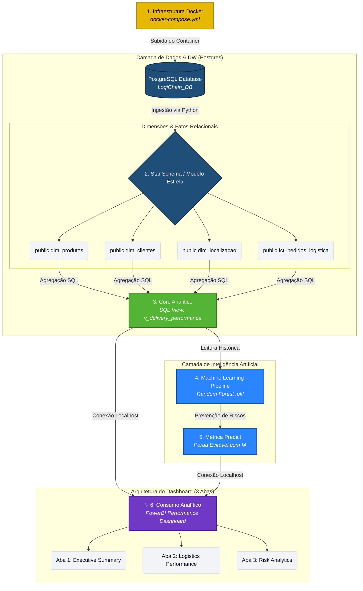
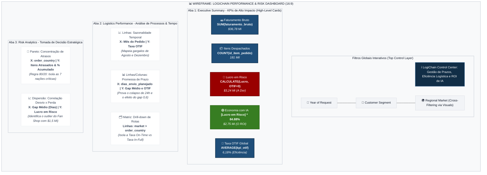
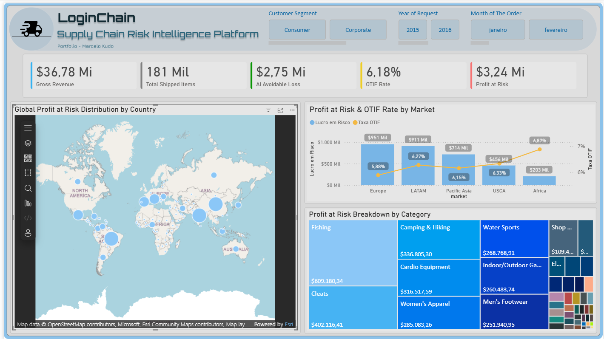
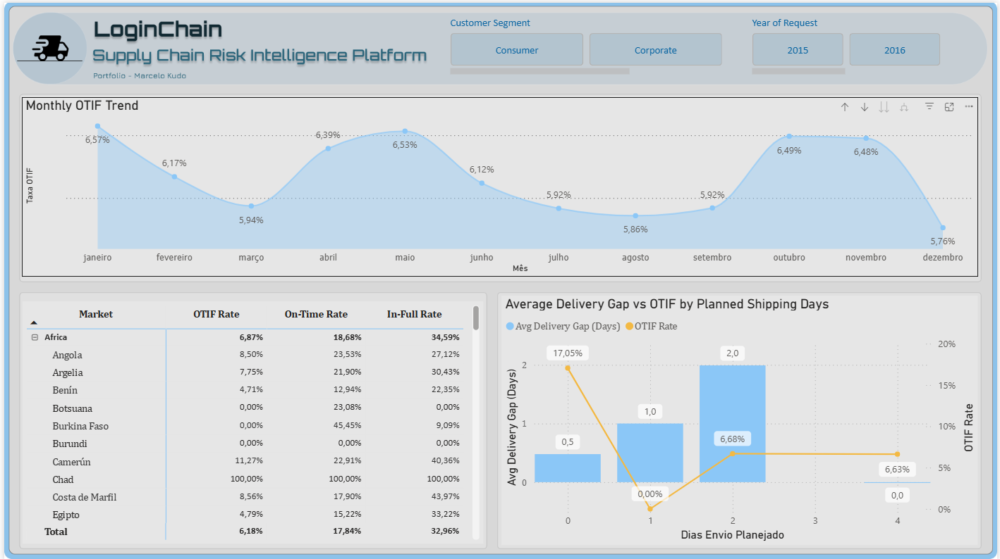
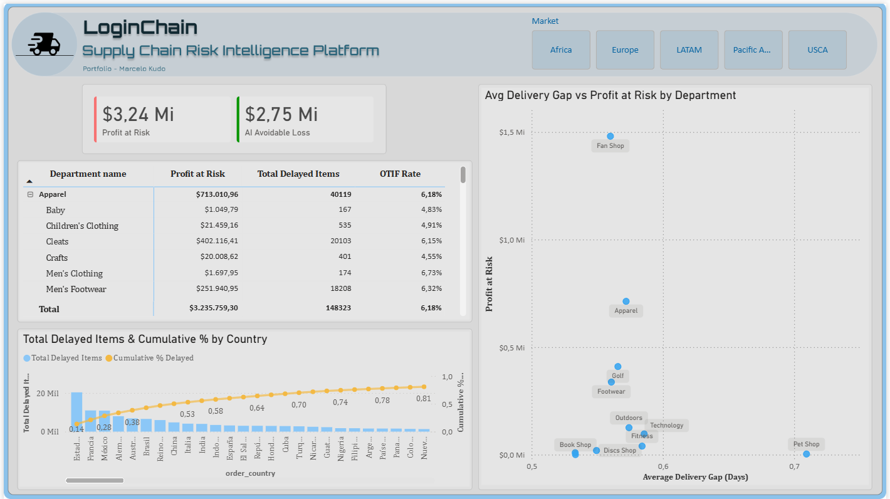

<div align="center">
  <br />
  <p align="center">
    
  </p>
  <p align="center">
    <b>Transformando operações logísticas globais em inteligência de risco financeiro</b>
  </p>

  [](https://www.python.org/)
  [](https://www.postgresql.org/)
  [](https://www.docker.com/)
  [](https://powerbi.microsoft.com/)
  <br />
  <hr />
</div>

### ⚡ TL;DR

Plataforma end-to-end de dados que transforma operações logísticas em inteligência de risco financeiro usando Data Warehouse, Machine Learning e BI.

* 📉 OTIF global crítico: 6.18%

* 💸 Exposição a risco: $3.24M

* 🤖 Economia estimada com IA: $2.75M

* 🧱 Stack: Docker • Postgres • Python • SQL • Power BI • ML (Random Forest)

---

### Problema de Negócio

A DataCo opera com uma cadeia global de e-commerce e logística enfrentando um colapso operacional crítico:

* Baixa taxa de entregas no prazo e completas (OTIF = 6.18%)
* Falta de visibilidade sobre gargalos reais da operação
* Perdas financeiras ocultas por falhas logísticas recorrentes
* Decisões baseadas em média agregada distorcida

👉 O problema não era transporte. Era inteligência operacional inexistente.

---

### Solução

O LogiChain foi projetado como uma plataforma analítica completa com 4 camadas:

1. Infraestrutura de Dados (Docker + PostgreSQL)
2. Data Warehouse em Star Schema
3. Camada Analítica com SQL Views
4. Machine Learning para previsão de risco
5. Dashboard executivo em Power BI

---

### Arquitetura de Dados & Data Pipeline
Arquitetura foca na descentralização e performance, utilizando o banco de dados relacional para processar regras de negócio pesadas via SQL Views, aliviando a carga cognitiva e de memória do Power BI.



📊 Data Warehouse Model

Modelo estrela otimizado para performance analítica:

* Dimensões:
    * public.dim_produtos
    * public.dim_clientes
    * public.dim_localização
* Fato:
    * public.dim_pedidos_logistica
* Camada semântica:
    * SQL Views para performance e abstração de regras de negócio

---

### Inteligência de Negócio: Wireframe do Dashboard (3 Abas)
O Dashboard foi construído seguindo padrões de UX/UI, estruturado em uma jornada analítica que vai do sumário executivo até a causa raiz de perdas financeiras.


📈 Inteligência de Negócio (KPIs)

| Métrica             | Valor     | Interpretação        |
| ------------------- | --------- | -------------------- |
| OTIF Global         | 6.18% 🔴  | Eficiência crítica   |
| Pedidos processados | 181K 📦   | Volume operacional   |
| Lucro em risco      | $3.24M 💸 | Exposição financeira |
| Economia com IA     | $2.75M 🟢 | ROI potencial        |

---

### Principais Insights
1. Problema estrutural mascarado por média

    O gap médio de entrega (~0.6 dias) escondia atrasos críticos devido à compensação estatística entre adiantamentos e atrasos.

2. Falha total em entregas expressas

    Pedidos com promessa de 1 dia apresentam 0% OTIF, revelando colapso em SLAs agressivos.

3. Gargalo interno, não logístico

    Mesmo com transporte eficiente, OTIF permanece baixo (~6%), indicando falhas em:

    * separação
    * faturamento
    * processos internos

4. Concentração de risco (Pareto)

    7 países concentram ~80% dos atrasos globais, permitindo foco operacional direcionado.

5. Categoria crítica: Fan Shop

    Responsável por $1.5M em risco financeiro, sendo o maior hotspot da operação.

---

### Machine Learning (Risk Engine)

Foi desenvolvido um modelo de classificação para previsão de atrasos logísticos:

* Algoritmo: Random Forest
* Métrica principal: PR-AUC = 0.7978
* Abordagem: dados históricos + features de rota e tempo de processamento
* Objetivo: antecipar falhas antes da execução logística

💰 Impacto estimado:
Redução potencial de perdas financeiras em $2.75M

--- 

### Dashboard (Power BI)

O painel foi estruturado em 3 níveis analíticos:

#### 1. Executive Summary

* KPIs financeiros e operacionais
* Visão de saúde global da operação
#### 2. Logistics Performance

* Sazonalidade de atrasos
* Gap entre promessa e entrega
* Drill-down por região
#### 3. Risk Analytics

* Pareto de países críticos
* Correlação entre atraso e perda financeira
* Identificação de outliers operacionais

---

### Tecnologias Utilizadas
Data Engineering
* Docker
* PostgreSQL
* SQL (views e modelagem dimensional)

Data Science
* Python 3.10
* Pandas
* Scikit-learn
* Random Forest

Business Intelligence
* Power BI
* DAX
* Modelagem analítica e UX de dashboards

--- 

### Como Executar

1. Clone do repositório
```bash
git clone https://github.com/seu-usuario/logichain-performance-analytics.git
```
2. Inicialize o banco de dados no container Docker:
``` bash
docker-compose up -d

Passos seguintes:

a. O banco de dados PostgreSQL subirá automaticamente em localhost:5432.

b. O container etl_service iniciará em sequência para popular o Data Warehouse.

c. Abra o arquivo .pbix localizado na pasta / powerbi para explorar os dados.
```

3. Baixe os dados do Kaggle:
``` bash
https://www.kaggle.com/datasets/shashwatwork/dataco-smart-supply-chain-for-big-data-analysis
```

---

### Resultado Final

O LogiChain transforma dados logísticos brutos em inteligência acionável de risco financeiro, permitindo:

Identificação de gargalos invisíveis
Priorização de regiões críticas
Previsão de falhas operacionais
Quantificação do impacto financeiro da ineficiência

---

### Visão

Este projeto simula uma arquitetura real de uma plataforma de dados corporativa moderna:

Data Warehouse + Analytics + Machine Learning + BI = decisão orientada a valor

---

### 👨‍💻 Autor

Desenvolvido por Marcelo Kudo